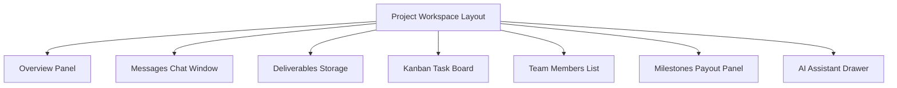
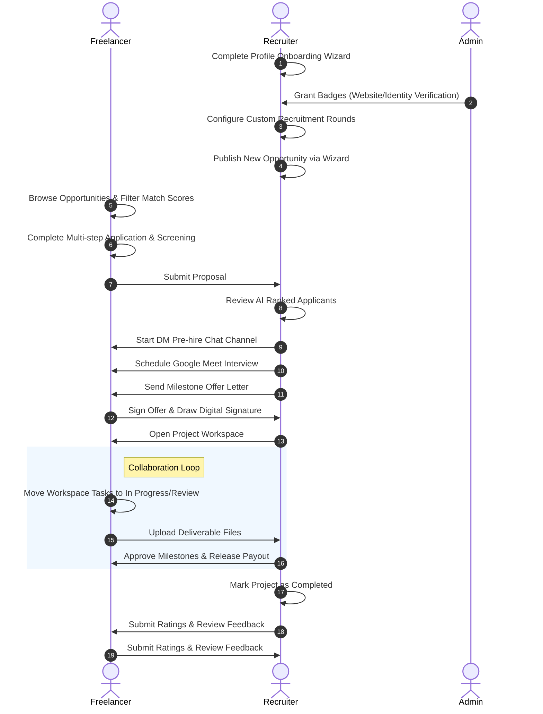

# Talentra: Complete Application Pages, Interface, and Workflow Specifications

Talentra is a state-of-the-art freelance matching platform built using **Next.js 15 App Router**, **Prisma ORM**, **PostgreSQL**, and styled with sleek vanilla Tailwind CSS. This document provides a exhaustive, granular guide to every screen, layout, button, form field, validation rule, database metric, and workflow path within the codebase.

---

## 1. Global Navigation, Architecture & Security Guardrails

### 1.1 Layout Frameworks & Shells
*   **Public Portal Shell (`src/components/Navbar.tsx`)**:
    *   Used for guest users before logging in.
    *   **Header Links**: Home (`/`), Features (`/features`), About (`/about`), Contact (`/contact`).
    *   **Action Buttons**: *Login* (directs to `/login`), *Register* (directs to `/register`).
*   **Dashboard Portal Shell (`src/components/DashboardLayout.tsx` & `src/components/Sidebar.tsx`)**:
    *   Responsive collapsible side drawer layout wrapping all authenticated paths.
    *   **Header Bar**: Represents the user session with dynamic profile image fallback (SVG initial avatars), user name, active notifications indicator, and a *Logout* action.
    *   **Sidebar Links (Role-Specific)**:
        *   **Freelancer**: Dashboard, Profile, Browse Projects, Applications, Completed Projects, Reviews.
        *   **Company**: Dashboard, Company Profile, Manage Projects, Proposals Board.
        *   **Admin**: Dashboard, Users Directory, Freelancers, Companies, Projects, Reviews, Matching Settings.

### 1.2 Onboarding Access Padlocks
*   **Guard Logic**: If a Freelancer or Company user hasn't finished their profile onboarding (marked by `ONBOARDING_COMPLETED` not present in `verificationBadges`), the sidebar links for sections other than Dashboard and Profile are locked.
*   **UI Representation**: Locked links are disabled, styled in light gray opacity, and appended with a lock icon (`Lock` from lucide-react). Clicking them triggers a toast notification: *"Please complete your profile configuration first."*

---

## 2. Guest Portal & Authentication Gateways

### 2.1 Public Landing Pages
*   **Home Page (`src/app/page.tsx`)**:
    *   **Hero Section**: Dynamic matching graphics with floating showcase mock widgets showing current average match metrics ("94% Skills Fit").
    *   **Smart Search Component**: Input field for keywords (e.g. "React developer") and a dropdown list selector for Categories.
    *   **Interactive Mocks Grid**: Demonstrates actual talent cards matching dummy projects.
*   **About Page (`src/app/about/page.tsx`)**:
    *   **Engineering Philosophy Cards**: Mission details, developer availability stats, and technology stack badges.
*   **Features Page (`src/app/features/page.tsx`)**:
    *   **Core Pillars Matrix**: 6-card interactive grid representing AI Matching, Digital Milestones, Pre-hire DM Channels, Verification Audits, Live Workspaces, and double-review feedback grids.
*   **Contact Page (`src/app/contact/page.tsx`)**:
    *   **Inquiry Form Fields**:
        *   `Full Name` (Text input, validation: required).
        *   `Email Address` (Email input, validation: format check, required).
        *   `Topic Subject` (Dropdown select: Support, Sales, Partnerships, Others).
        *   `Message Box` (Text area input, validation: minimum 20 characters).
    *   **Submit Button**: Green hover state, turns to "Sending..." with a spinner during submission.

### 2.2 Credentials & OAuth Gateways
*   **Sign In Page (`src/app/login/page.tsx`)**:
    *   **Interactive Components**:
        *   `Email` input field.
        *   `Password` input field with toggle show/hide eyeball icon.
        *   `Google SSO` auth card button.
        *   `Credentials Submit` button.
    *   **Developer Sandbox Access Panel**: Three quick login simulator buttons allowing developers to bypass credentials to access:
        *   *Admin Dashboard* (Simulator for `role: ADMIN`).
        *   *Company Recruiter Panel* (Simulator for `role: COMPANY`).
        *   *Freelancer Profile* (Simulator for `role: FREELANCER`).
*   **Register Page (`src/app/register/page.tsx`)**:
    *   **Fields**:
        *   `Full Name` (Text input, required).
        *   `Email Address` (Email input, required).
        *   `Password` (Password input with complexity checks: min 8 characters, numbers, letters).
        *   `Account Role Toggle`: Styled as a double-segmented button selector allowing users to choose either **Freelancer** or **Company Recruiter**.
    *   **Submit Handle**: Creates the generic User object, hooks it to standard database templates, and redirects to the dashboard onboarding path.

---

## 3. Freelancer Portal (Talent Perspectives)

### 3.1 Freelancer Dashboard (`src/app/freelancer/dashboard/page.tsx`)
*   **AI Match Ring Indicator**: A circular SVG progress indicator showing the user's overall average compatibility rating against available platform projects.
*   **Quick Metrics Grid**:
    *   `Active Engagements` (Numeric count link to workspaces).
    *   `Profile Status` (Badge: "Onboarding Completed" / "Pending Action").
    *   `Unread Messages` (Numeric counter).
*   **Recommendations Grid**: List of 3 top AI-matched project cards showing Match Score percentage, required skills badges, and a "Quick Apply" CTA.

### 3.2 Detailed Onboarding Form (`src/app/freelancer/profile/ProfileForm.tsx`)
*   **Dynamic Completion Rating**: Progress bar calculates profile completeness based on filled data slots.
*   **Profile Form Tab Navigation**:
    *   **Tab 1: Basic Info**:
        *   `Headline Title` (e.g. "Lead React Engineer").
        *   `Years of Experience` (Numeric input).
        *   `Response Time SLA` (e.g. "Within 2 Hours").
        *   `Hourly Base Rate` (Numeric input in USD).
        *   `Bio Overview` (Textarea).
        *   `Profile Photo` & `Resume PDF` upload widgets (Convert files to Base64 in-client before submitting to action endpoints).
    *   **Tab 2: Work Timeline**:
        *   List builder for past roles containing `Job Title`, `Company Name`, `Start Date`, `End Date` (or `Currently Working` checkbox), and `Responsibilities description`.
    *   **Tab 3: Certifications**:
        *   List builder containing `Credential Title`, `Issuing Organization`, `Year`, and optional `Credential PDF Upload`.
    *   **Tab 4: Portfolio Showcase**:
        *   Card selector containing `Project Title`, `Description`, `Website URL`, `Asset Type` (Image, Video, Link, CASE_STUDY), and media file attachment widgets.
    *   **Tab 5: Calendar Grid & Availability**:
        *   Select dropdown for base state: `AVAILABLE`, `BUSY`, `UNAVAILABLE`.
        *   Interactive calendar selector to lock specific dates.

### 3.3 Projects Directory & Apply Wizard
*   **Browse Projects (`src/app/freelancer/projects/ProjectsBrowser.tsx`)**:
    *   **Search Box**: Real-time keyword filter.
    *   **Filter Sidebar**: Min budget input, experience years threshold, urgency selector, required skills tag search.
    *   **Interactive Cards**: Project briefs with a "Bookmark Opportunity" toggle and "Review Brief" redirect buttons.
*   **Project Detail Brief (`src/app/freelancer/projects/[id]/ProjectDetailsView.tsx`)**:
    *   Displays full details: budget, start/end date, daily deliverables list, required vs preferred skills, and public Recruiter Q&A board (Discussion board).
*   **Apply Wizard (`src/app/freelancer/projects/[id]/apply/ProjectApplyWizard.tsx`)**:
    *   **Step 1: Term Review**: Agreement checkboxes acknowledging IP rules and task deadlines.
    *   **Step 2: Screening Questionnaire**: Dynamically builds inputs based on the recruiter's setup:
        *   `Yes/No Questions` (Radio button selectors).
        *   `Paragraph Questions` (Textarea).
        *   `Code Assessments` (Embedded text inputs).
    *   **Step 3: Cover Letter Pitch**: Pitch textarea (validation: minimum 150 characters).
    *   **Submit Button**: Executes recommendation models and redirects to applications tracker.

### 3.4 Proposal Manager (`src/app/freelancer/applications/page.tsx` & `FreelancerApplicationCard.tsx`)
*   **Applications List**: Tracks the pipeline stages: `Applied` -> `Shortlisted` -> `Interview` -> `Offer Received` -> `Hired`.
*   **Action Drawer widgets**:
    *   **Interview Step**: Display Google Meet link, date, time, and "Click to Join" buttons.
    *   **Direct Message**: Inline recruiter pre-hire chat.
    *   **Offer Sent Step**: Interactive digital contract panel showing final budget milestones. Displays two buttons: **Accept Offer & Sign Contract** (prompts user to draw or type their signature name) and **Decline Offer** (prompts reason input).

### 3.5 Completed Projects & Feedback (`src/app/freelancer/completed-projects/page.tsx`)
*   **Contracts Ledger**: Displays completed assignments.
*   **Feedback Submision Form**: Rating input stars (1-5) and feedback comment fields for:
    *   `Payment Reliability` (1-5 Rating).
    *   `Project Clarity` (1-5 Rating).
    *   `Communication Quality` (1-5 Rating).

---

## 4. Company Portal (Recruiter Perspectives)

### 4.1 Company Recruiter Dashboard (`src/app/company/dashboard/page.tsx`)
*   **Analytics Overview Grid**:
    *   `Active Projects` (Hired teams working).
    *   `Total Active Openings` (Currently accepting applicants).
    *   `Hired Talent headcount` (Total freelancers hired).
*   **Applicant Activity Feed**: Highlights the latest applicants with matching scores and links to detail review cards.

### 4.2 Recruiter Settings Onboarding (`src/app/company/profile/ProfileForm.tsx`)
*   **Tabs Navigation**:
    *   **Tab 1: Basic details**:
        *   `Recruiter Organization Name`, `Description Summary`, `Website Address`, `LinkedIn Page`, `Industry Select`.
        *   Logo (image upload) and Cover Banner (horizontal image upload).
        *   Office Locations (comma-separated text input mapping into a db array).
    *   **Tab 2: Values & Culture**:
        *   Text areas for `Mission Statement`, `Work Culture description`, and `Hiring Philosophy details`.
    *   **Tab 3: Team Showcase & Perks**:
        *   `Team Card Builder`: Add team members with their name, role, bio, LinkedIn, and photo.
        *   `Benefits Checklist`: Commute, health, remote work stipends.
        *   `Gallery Uploader`: Office environment photos and video links.
    *   **Tab 4: Verification Badges**:
        *   Toggle controls to request platform verification badges ("Identity Verified", "Website Verified", "Payment Verified").

### 4.3 Post Opportunity Creation Wizard (`src/app/company/projects/new/page.tsx`)
*   **Step 1: Core Details**:
    *   `Opportunity Title` (Text input, required).
    *   `Opportunity Domain` (Dropdown select: Software, Design, Marketing, etc.).
    *   `Category` & `Subcategory` inputs.
    *   `Required Minimum Experience` (Numeric input).
    *   `Visibility Settings` (Dropdown select: PUBLIC, PRIVATE, INVITE_ONLY).
    *   `Preferred Candidate Gender` (Dropdown select: ANY, MALE, FEMALE).
*   **Step 2: Scope Description & Skills**:
    *   `Job Description` (Textarea).
    *   `Required Primary Skills` & `Preferred Secondary Skills` tags builder (Add skills tags dynamically).
    *   `Objectives`, `Deliverables`, and `Daily Tasks` list builders.
*   **Step 3: Budget & Timeline**:
    *   `Compensation Type` (Dropdown select: Unpaid, Paid, Stipend).
    *   `Opportunity Budget` (Numeric input).
    *   `Working days schedule` & `Timing Structure` selects.
    *   `Application Deadline`, `Kickoff Date`, and `Completion Date` inputs.
*   **Step 4: Recruitment Rounds Builder**:
    *   Recruiters configure custom hiring stages. By default, three stages are created: CV Pitch, Screening Questionnaire, and Recruiter Interview.
    *   **Rounds Timeline List**: Supports drag-and-drop to re-order.
    *   **Questionnaire Builder**: Allows adding screening questions:
        *   *Supported Types*: `YES_NO`, `MULTIPLE_CHOICE`, `PARAGRAPH`, `PORTFOLIO`, `VIDEO_INTRO`, `CODING_ASSESSMENT`, `ASSIGNMENT`.
*   **Step 5: Preview & Publish**:
    *   Validates all wizard steps and publishes the project to the public matching ledger.

### 4.4 Proposals Evaluation Board (`src/app/company/applicants/ApplicantsList.tsx` & `ApplicantDetailView.tsx`)
*   **Proposals List Table/Card Toggle**: Shows candidates sorted by AI score.
*   **Filter Drawer**: Filters applicants by minimum match score, experience, and application date.
*   **Bulk Transition Toolbar**: Allows selecting multiple candidates via checkboxes and transitioning their stages simultaneously (e.g., Shortlist, Invite to Interview, Reject).
*   **Candidate Profile Details Panel**:
    *   Displays cover letter, resume link, matching score details, work timeline, portfolio screenshot popups, and screening answers.
    *   **Video Interview Scheduler**: Displays fields for date, time, and meeting link. Click "Schedule Meet" to automatically notify the candidate and set their application state to `Interview Scheduled`.
    *   **Direct Message Drawer**: Pre-hire chat channel allowing text chat, editing, and deleting sent messages.
    *   **Offer Sent Tab**: Recruiter writes the offer letter description, specifies the final budget, and defines milestone payout allocations. Click "Send Offer" to deliver the digital contract.

---

## 5. Project Workspace & Collaboration Portal

The workspace (`src/components/WorkspaceView.tsx`) is a real-time collaboration environment loaded once a contract is signed.

### 5.1 Overview Panel
*   Displays the project description, deliverables, application details, contract milestones, kickoff coordinates, and the current project status banner (OPEN, IN_PROGRESS, COMPLETED, CLOSED).
*   **recruiter controls**: Click "Mark Project as Completed" once deliverables are approved, which triggers feedback review modal popups.

### 5.2 Messages Chat Window
*   **Channel Navigation**: Users switch between the project group chat, freelancers-only chat channel, and private direct messaging channels with colleagues.
*   **Chat Input Bar**:
    *   Text input with emoji picker support.
    *   **Voice Message Recording Widget**: Record voice messages directly in the workspace chat. Displays recording timer and audio wave animations.
    *   **Attachment Clip**: Upload code files, screenshots, or asset archives directly into the chat window.

### 5.3 Deliverables Storage
*   File repositories tracking files uploaded during the project.
*   **Actions**:
    *   *Upload Deliverable Form*: Select local file, write description note, select target task/milestone to link it to, and upload.
    *   *Search Bar*: Filters files by name, uploader, or upload date.

### 5.4 Kanban Task Board
*   **Board vs Timeline Switches**: Switch layout styles between a Kanban Board and a Gantt-style chronological list.
*   **Kanban Columns**: `Todo`, `In Progress`, `Review`, and `Done`.
*   **Drag-and-Drop Columns Interaction**: Drag tasks across columns to update their status.
*   **Task Card details**: Displays task name, description, priority badge, due date, and avatar of the assignee.
*   **Add Task Modal**: Fields: `Task Title`, `Description`, `Priority` (LOW, MEDIUM, HIGH), `Assignee Selector` (Dropdown of hired freelancers), and `Due Date`.

### 5.5 Team Members List
*   Displays names, roles, emails, and avatars of all participants.
*   **Quick Chat CTA**: Click "Message" on any team member to open a private direct message channel.

### 5.6 Milestones Payout Panel
*   Displays contract milestones, status tracking, budget allocations, and linked deliverable files.
*   **Recruiter Release Controls**: recruiter can click "Release Payout" on pending milestone steps.

### 5.7 AI Assistant Drawer
*   A side drawer featuring a workspace AI chatbot.
*   **Features**: Answer questions about milestone timelines, task assignments, and budget allocations.

---

## 6. Admin Portal (Platform Management)

### 6.1 Analytics Dashboard (`src/app/admin/dashboard/page.tsx`)
*   **Analytics Cards Grid**: Total Users, Registered Freelancers, Registered Companies, Active Gigs, and Completed Contracts.
*   **Platform Activity Feed**: System logs recording registrations, contract signings, and milestone payout releases.

### 6.2 Users Directory (`src/app/admin/users/page.tsx`)
*   **User Directory Table**: Displays a searchable list of registered users.
*   **Actions**:
    *   *Create User Modal*: Inputs: `Name`, `Email`, `Role`, `Password`.
    *   *Update Role Dropdown*: Change a user's role (e.g., promote a user to Admin).
    *   *Delete User Button*: Permanently delete a user account.

### 6.3 Freelancers & Companies Directories (`src/app/admin/freelancers/page.tsx` & `src/app/admin/companies/page.tsx`)
*   **Moderator tables**: Display biographies, experience metrics, review scores, verification badges, and links to public profiles.
*   **Actions**: Verify, edit info details, or flag profiles.

### 6.4 Projects & Reviews Moderator (`src/app/admin/projects/page.tsx` & `src/app/admin/reviews/page.tsx`)
*   **Listing Audits**: Search, delete, or suspend spam reviews and matching listings.

### 6.5 Matching Settings (`src/app/admin/settings/page.tsx`)
*   **AI Weights Configuration Form**: Configure settings for the AI recommendation system.
    *   `Skills Matching weight` (Default: 50%).
    *   `Experience weight` (Default: 20%).
    *   `Average Rating score weight` (Default: 15%).
    *   `Completion Rate weight` (Default: 10%).
    *   `Priority factor weight` (Default: 5%).
    *   *Validation*: The sum of all weights must equal exactly 100%.

---

## 7. Integrated Platform Workflow Map

The following workflow maps out the lifecycle of a project on the platform:

1.  **Registration & Profile Completion**: A new recruiter registers, goes through the Onboarding Wizard (creating their bio, teams, logo, and cover layouts), and gets verified by an Administrator.
2.  **Opportunity Creation**: The recruiter launches the **Opportunity Creation Wizard**, defines requirements, builds custom recruitment stages (e.g., adding technical screening questions), and publishes the project.
3.  **Search & Filtering**: A verified freelancer browses the directory and filters opportunities using the search filters and the AI Match rating.
4.  **Submission**: The freelancer completes the Screening Questionnaire, reviews the agreements, writes a pitch letter, and submits the proposal.
5.  **Review & Assessment**: The recruiter reviews candidates ranked by the AI recommendation engine.
6.  **Screening**: The recruiter uses the Pre-Hire DM Chat to ask follow-up questions, schedules a video interview, and conducts the assessment.
7.  **Offer & Contracting**: The recruiter transitions the application stage to "Selected" and delivers the Offer Letter, specifying budget milestone payout details.
8.  **Signing & Kickoff**: The freelancer signs the digital contract. A **Project Workspace** is automatically opened, granting workspace access to both parties.
9.  **Execution & Delivery**:
    *   The freelancer updates task statuses on the Kanban Board.
    *   The freelancer submits project artifacts via the Workspace Deliverables tab.
    *   Collaborators communicate in the Workspace chat, share files, and record voice notes.
    *   The Recruiter reviews deliverables, moves tasks to completed, and releases milestone payments.
10. **Completion & Review**: Once all milestones are completed, the Recruiter marks the project as finished. This prompts the client-freelancer reviews panel, allowing both users to write reviews and rate each other.
